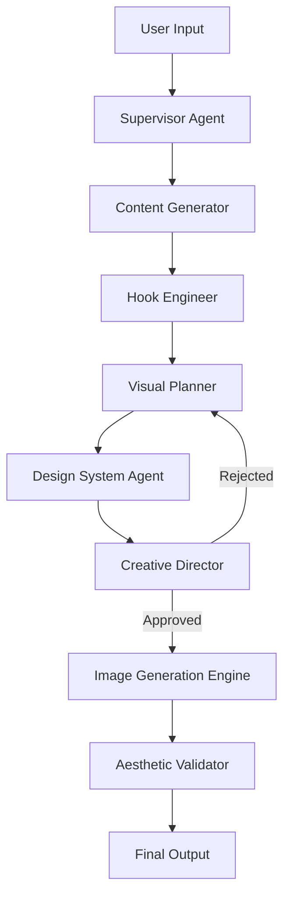

# 🎠 CarouselMaster AI: God Tier Carousel Generation

> **The Enterprise-Grade, Multi-Agent Platform for Viral Instagram Carousels.**
> *Powered by Mastra AI, Gemini 2.5 Flash, and OpenAI GPT-4o.*

---

## 🚀 Overview

**CarouselMaster AI** is not just another content generator. It is a **God Tier** agentic workflow system designed to autonomously craft high-converting, visually stunning Instagram carousels.

It combines **advanced psychological frameworks** (hooks, storytelling) with **state-of-the-art hybrid rendering** (AI generation + programmatic design overlays) to produce content that stops the scroll.

### ✨ Key Features
- **🤖 Multi-Agent Orchestration**: A team of specialized AI agents (Content, Design, Strategy, Review) working in harmony.
- **🎨 Hybrid Rendering Engine**: Combines the creativity of **Gemini 2.5 Flash / Flux** with the precision of **Canvas API** for pixel-perfect typography and safe zones.
- **🧠 Psychology-Driven**: Engineers hooks and content structures based on proven viral frameworks.
- **🛡️ Brand Guardrails**: Enforces brand consistency (colors, fonts, tone) across every slide.
- **⚡ Enterprise Architecture**: Built on Next.js 15, Mastra, and Node.js for scale.

---

## 🏗️ Architecture

The platform operates as a sophisticated pipeline of autonomous agents:



### The Agent Team
| Agent | Role | Model |
|-------|------|-------|
| **ContentGenerator** | Crafts viral narratives and educational value. | GPT-4o-mini |
| **HookEngineer** | Brainstorms 5+ hook variations to maximize CTR. | GPT-4o |
| **ImageGenerator** | Prompts and generates stunning visuals. | Gemini 2.5 |
| **DesignSystem** | Defines typography, layout, and color hierarchy. | GPT-4o-vision |
| **CreativeDirector** | Reviews output against brand guidelines. | GPT-4o |
| **AestheticValidator** | Final quality check using Vision AI. | GPT-4o-vision |

---

## 🛠️ Hybrid Rendering Technology

We don't just ask AI to "make an image with text" (which often fails). We use a **God Tier Hybrid Approach**:

1.  **Visuals**: AI generates the *background* and *visual elements* with strict "negative space" prompting.
2.  **Safe Zones**: We enforce a **100px safe zone** and clean composition to ensure text readability.
3.  **Typography**: We programmatically overlay text using the **Canvas API**, ensuring:
    - Perfect contrast (WCAG AA).
    - Brand-specific fonts (Inter, Playfair, etc.).
    - Dynamic text wrapping and layout.

---

## 🚀 Getting Started

### Prerequisites
- Node.js 20+
- OpenAI API Key
- Google Gemini API Key
- Fal.ai Key (for Flux/Dev)

### Installation

```bash
# Clone the repository
git clone https://github.com/your-repo/carousel-master-ai.git

# Install dependencies
npm install

# Set up environment variables
cp .env.example .env
# Fill in your API keys
```

### Running the Development Server

```bash
npm run dev
```

### Running the God Tier Workflow

```bash
# Run the verification script
npx tsx src/mastra/test-god-tier-workflow.ts
```

---

## 📂 Project Structure

```
src/
  mastra/
    agents/       # The brain trust (AI Agents)
    tools/        # The hands (API tools, Rendering)
    workflows/    # The nervous system (Orchestration)
    schemas/      # The laws (Zod Validation)
```

---

## 🌟 Why "God Tier"?

- **Self-Healing**: If the Creative Director rejects a design, the system automatically re-plans and re-generates.
- **Visual Consistency**: Uses reference image injection to ensure characters and styles remain consistent across slides.
- **Pixel Perfection**: Programmatic overlays guarantee that text is never cut off, blurry, or hallucinated.

---

**Built with ❤️ by the Agentic AI Team.**
